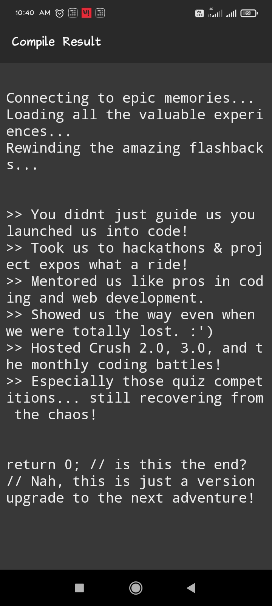

# Farewell Tribute in C 🚀💙


---

🙌 2. Project Description

## 🎓 A Farewell Tribute to Our Mentor - Nikhil Dada 💙

This fun and heartfelt C program is dedicated to our programming mentor **Nikhil Dada**, who didn’t just teach us code — he showed us how to dream, lead, and grow!

It simulates a terminal-based tribute using slow typewriter animation to bring back the best flashbacks of our journey together at **GCOEY**.


---

⚙️ 3. How to Run

### 💻 How to Run the Code:

1. Copy the code into a file like `farewell.c`
2. Open terminal and run:
   ```bash
   gcc farewell.c -o farewell
   ./farewell

3. Sit back and enjoy the memories 💫


---

## 📸 **4. Screenshot Preview**

```markdown
### 📸 Preview


> Tip: Upload your screenshot to GitHub repo first. Then right-click → "Copy image address" and paste the link above in place of the filename if using online.
```



---

## 📬 Contact Me

- 👨‍💻 GitHub: [@girishmohakar](https://github.com/girishmohakar)
- 💼 LinkedIn: [Girish Mohakar](https://www.linkedin.com/in/girish-mohakar-96b9ab)
- 📧 Email: girishmohakarentc@gmail.com 

---

